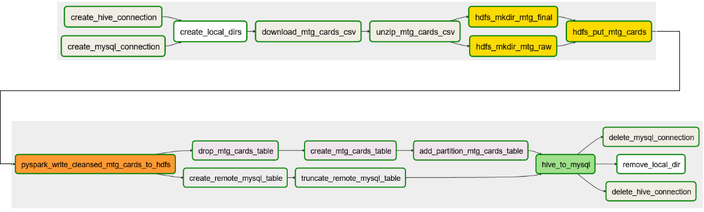

# Big Data - Magic the Gathering

## Aufgabenstellung

Erstellung einer Magic the Gathering (MTG) Karten Datenbank.

Es gibt viele Internetseiten, die MTG Daten in unterschiedlichen Formaten anbieten. Diese Daten sollen genutzt werden, um eine durchsuchbare Karten Datenbank zu erstellen. Dafür soll eine einfache Weboberfläche erstellt werden. Der Workflow soll sich an folgender Struktur orientieren:

1. Datenbeschaffung (API, CSV, JSON,...)
2. Rohdatenspeicherung im Hadoop File System (HDFS)
3. Bearbeitung/Bereinigung der Daten
4. Speicherung der finalen Daten im HDFS
5. Datentransfer in eine Datenbank (MySQL, MongoDB,...)
6. Frontend/Backend zur Visualisierung inkl. Suchfunktion

Voraussetzung:

- Implementierung mit einem ETL Workflow Tool (hier: Airflow)
- Automatische Ausführung

## Umsetzung

Die folgende Grafik zeigt den groben Ablauf des ETL Workflows:


Zuerst wird eine komprimierte Datei mit mehreren CSV Dateien von MTGJSON.com heruntergeladen.


Das Download Userinterface der Seite lässt sich umgehen, indem man die direkte [API URI](https://mtgjson.com/api/v5/AllPrintingsCSVFiles.tar.gz) herausfindet und angibt. Sie sieht wie folgt aus: `https://mtgjson.com/api/v5/AllPrintingsCSVFiles.tar.gz`. Die heruntergeladene Datei wird entpackt und die darin enthaltene `cards.csv` wird im HDFS gespeichert. Danach ließt PySpark die Datei ein und *cleaned* die Daten. Die finale CSV Datei wird wieder im HDFS abgelegt. Ein Hive Table wird angelegt und die Daten werden schließlich in eine MySQL Datenbank kopiert. Mit einem simplen Back- und Frontend werden die Karten visualisiert.

### Airflow Tasks

Die Graphview gibt einen schnellen Überblick über alle Tasks und zeigt mit einer farblichen Umrandung ihren Status an.



Die Tasks haben folgende Aufgaben:

Task | Funktion
---- | --------
create_hive_connection | Erstellen einer Hive Connection via Bash Command.
create_mysql_connection | Erstellen einer MySQL Connection via Bash Command.
create_local_dirs | Anlegen der lokalen Verzeichnisse `/home/airflow/mtg` und `/home/airflow/mtg/data` 
download_mtg_cards_csv | Lädt die komprimierte Datei von MTGJSON.com in das lokale `/data` Verzeichnis herunter. 
unzip_mtg_cards_csv | Entpackt die heruntergeladene Datei. Die CSV Datei hat nun folgenden Pfad: `/home/airflow/mtg/data/AllPrintingsCSVFiles/cards.csv` 
hdfs_mkdir_mtg_raw | Legt das `/user/hadoop/mtg/raw/{{ year }}/{{ month }}/{{ day }}` Verzeichnis im HDFS an.
hdfs_mkdir_mtg_final | Legt das `/user/hadoop/mtg/final/{{ year }}/{{ month }}/{{ day }}` Verzeichnis im HDFS an.
hdfs_put_mtg_cards | Legt die entpackte lokale `cards.csv` Datei in das raw HDFS Verzeichnis.
pyspark_mtg_cards | Liest die CSV Datei vom HDFS ein und 'cleaned' die Daten. Linebreaks, Spalten, usw. werden entfernt. PySpark schreibt die finale CSV Datei in das `final` HDFS Verzeichnis. 
drop_HiveTable_mtg_cards | Löscht den Hive Table `mtg_cards`, falls vorhanden.
create_HiveTable_mtg_cards | Erstellt den Hive Table `mtg_cards`.
addPartition_HiveTable_mtg_cards | Fügt die Daten der finalen CSV Datei im HDFS in den Hive Table ein und fügt die Partition (year, month, day) ein.
create_remote_mysql_table | Legt den `mtg_cards` Table in der MySQL Datenbank an. Hierbei wird erstmals die anfangs erstellte MySQL Connection verwendet.
truncate_remote_mysql_table | Leert den `mtg_cards` Table in der MySQL Datenbank an.
hive_to_mysql | Transferiert die Daten aus dem Hive Table in den MySQL Table. Die Daten werden kopiert und der Hive Table bleibt erhalten.
delete_hive_connection | Löscht die anfangs angelegte Hive Connection.
delete_mysql_connection | Löscht die anfangs angelegte MySQL Connection.
remove_local_dir | Löscht das lokale Verzeichnis `/home/airflow/mtg/data`

Zusätzlich zur Graphview stellt Airflow die Abhängigkeiten der Tasks in einer Treeview dar:


Es lässt sich ablesen, welche Tasks paralellisiert ablaufen können und welche Tasks von bestimmten Vorgängern abhängig sind. Beispielsweise lassen sie die ersten beiden Tasks `create_hive_connection` und `create_mysql_connection` simultan ausführen. Der nächste Task `create_local_dirs` startet erst dann, wenn beide Verbindungen hergestellt sind. Diese Abhängigkeiten innerhalb der Reihenfolge lassen sich im DAG einfach definieren:

```python
# -------------------------------------------------
# Task Order
# -------------------------------------------------

create_hive_connection >> create_local_dirs
create_mysql_connection >> create_local_dirs

create_local_dirs >> download_mtg_cards_csv

download_mtg_cards_csv >> unzip_mtg_cards_csv

unzip_mtg_cards_csv >> hdfs_mkdir_mtg_raw >> hdfs_put_mtg_cards
unzip_mtg_cards_csv >> hdfs_mkdir_mtg_final >> hdfs_put_mtg_cards

hdfs_put_mtg_cards >> pyspark_mtg_cards

pyspark_mtg_cards >> drop_HiveTable_mtg_cards >> create_HiveTable_mtg_cards >> addPartition_HiveTable_mtg_cards
pyspark_mtg_cards >> create_remote_mysql_table >> truncate_remote_mysql_table

addPartition_HiveTable_mtg_cards >> hive_to_mysql
truncate_remote_mysql_table >> hive_to_mysql

hive_to_mysql >> delete_hive_connection
hive_to_mysql >> delete_mysql_connection
hive_to_mysql >> remove_local_dir
```

### Backend

Ein Express.js Backend wird verwendet, um die Daten aus der Datenbank zu lesen und in Form einer REST API bereitzustellen. Unter `http://localhost:4000` stellt das Backend folgende Routen zur Verfügung:

- `/api/cards` optional mit Query Parametern: `/api/cards&page=1&pageSize=100`
  - gibt alle Karten zurück
  - Pagination empfohlen, sodass das Frontend nicht überladen wird
- `/api/cards/:multiverseId`
  - gibt die Karte mit der passenden MultiverseID zurück
- `/api/cards/id/:id`
  - gibt die Karte mit der passenden ID zurück
- `/api/cards/name/:name`
  - gibt alle Karten zurück, deren Name dem Filter entspricht (substring)
- `/api/cards/artist/:artist`
  - gibt alle Karten zurück, deren Artist (Zeichner) dem Filter entspricht (substring)

Das Backend steht nicht im Fokus der Aufgabe und es wird auf jegliche Validierung von übergebenen Parametern verzichtet.

### Frontend

Zur Visualisierung der Karten wird ein Angular Frontend verwendet. Es ist erreichbar unter `http://localhost:80`.

## Setup

Um das Projekt auszuführen werden 2 Docker bereitgestellt. Die erste `docker-compose.yaml` führt den ETL Workflow aus. Es wird ein hadoop und ein airflow Container gestartet. Die zweite `docker-compose.yaml` startet das Back- und Frontend. Logischerweise kann das Frontend erst Daten anzeigen, wenn der ETL Workflow erfolgreich abgeschlossen ist und sich somit Daten in der Datenbank befinden.

### Airflow
Folgende Schritte müssen ausgeführt werden:

  - GitHub [Repository](https://github.com/mergej/big-data-mtg) clonen
  - `docker compose build` ausführen
  - `docker compose up` ausführen
  - Warten bis beide Container erfolgreich gestartet sind
  - Die Bash des hadoop Containers aufrufen: `docker exec -it hadoop bash` und die folgenden Befehle ausführen:
    - `sudo su hadoop`
    - `stop-all.sh` und anschließend `start-all.sh`
    - `hiveserver2`
  - `http://localhost:8080/admin` aufrufen und den DAG `MTG_CSV` starten

### Backend & Frontend
Folgende Schritte müssen ausgeführt werden:

  - GitHub [Repository](https://github.com/mergej/mtg-webpage) clonen
  - `docker compose build` ausführen
  - `docker compose up` ausführen
  - Warten bis das Frontend vollständig gebaut ist
  - Frontend erreichbar über `http://localhost:80`
